# **Bloque I: fundamentos de R.**

### Ejercicio 01.

Crea una función en R que tome como parámetro un valor de temperatura en celsius y devuelva su equivalente en kelvin

```{r FUNCION1}
celsius_a_kelvin <- function(temp_celsius) {
  temp_kelvin <- temp_celsius + 273.15
  return(temp_kelvin)
}

temperatura_en_kelvin <- celsius_a_kelvin(25)
print(paste(temperatura_en_kelvin, "K"))

```

### Ejercicio 02.

Crea una función que tome como parámetro dos vectores y devuelva una matriz, de manera que los vectores sean las columnas. Ten en cuenta que el programa debe garantizar que los vectores sean del mismo tamaño.

```{r tarea2}

crear_matriz <- function(vector1, vector2) {
  if (length(vector1) != length(vector2)) {
    stop("Error: NO puedes crear una matriz con vectores de diferente tamaño, capaz podrías rellenar de 0")
  }
  

  matriz <- cbind(vector1, vector2)
  
  return(matriz)
}


v1 <- c(12, 28, 73, 54)
v2 <- c(51, 76, 87, 68)


matriz_resultado <- crear_matriz(v1, v2)
print(matriz_resultado)

```

### Ejercicio 03.

Toma el mismo proceso que en el ejercicio anterior pero haciendo que ahora los vectores ocupen las filas de la matriz, en lugar de las columnas.

```{r tarea3}

crear_matriz_filas <- function(vector1, vector2) {
  if (length(vector1) != length(vector2)) {
    stop("Error: NO puedes crear una matriz con vectores de diferente tamaño, capaz podrías rellenar de 0")
  }
  
  matriz <- rbind(vector1, vector2)
  
  return(matriz)
}

v1 <- c(1, 2, 3, 4)
v2 <- c(5, 6, 7, 8)

matriz_resultado <- crear_matriz_filas(v1, v2)
print(matriz_resultado)

```

### Ejercicio 04.

Crea una función que tome como parámetro dos vectores y devuelva el tamaño del más pequeño.

```{r tarea 4}


tamaño_vector_menor <- function(vector1, vector2) {
  if (length(vector1) == 0 || length(vector2) == 0) {
    stop("Error: Ambos vectores deben tener elementos.")
  }
  
  tamaño_menor <- min(length(vector1), length(vector2))
  
  return(tamaño_menor)
}


v1 <- c(1, 2, 3, 4, 5)
v2 <- c(5)


tamanio_resultado <- tamaño_vector_menor(v1, v2)
print(tamanio_resultado)


```

# **Bloque II: representaciones gráficas con point y plot.**

### Ejercicio 01.

Crea una función en R que dibuje la siguiente gráfica

###### Imagen del profe:

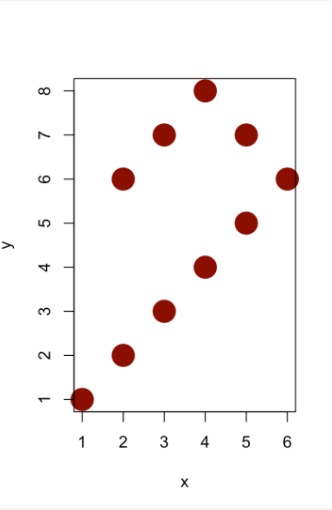

###### Mi solución:

```{r}
# Función para crear la gráfica
dibujar_grafica <- function() {
  x    <- c(1, 2, 3, 4, 5, 6, 5, 4, 3, 2 )   
  y   <- c(1, 2, 3, 4, 5, 6, 7, 8, 7, 6)  
  par(pty="s")

  plot(x, y,
       pch = 16,              
       col = "brown4",       
       cex =3,          
       xlim = c(0, 6),      
       ylim = c(0, 8),   
       xlab = "x",        
       ylab = "y")
}


dibujar_grafica()


```

# **Bloque III: representación de redes con iGraph.**

Al igual que en el bloque 2, vamos a replicar diversas imágenes dadas por el enunciado:

Para eso usaremos la librería \***graph** vista en clase:

```{r cargar_librería, message=FALSE}
# Verificar si igraph está instalado y si no, instalarlo
if (!require(igraph)) {
  install.packages("igraph")
} 
library(igraph)

```

#### Grafo 1

###### Imagen del profe:

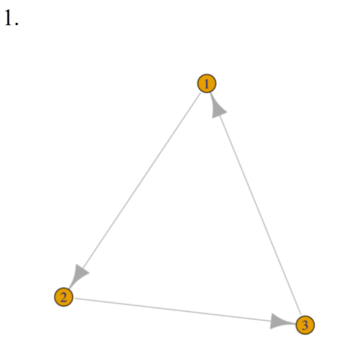

###### Mi solución

```{r igraph}

grafo <- graph(edges = c(1, 2, 2, 3, 3, 1), n = 3, directed = TRUE)


plot(grafo,
     vertex.size = 30,       
     vertex.label = V(grafo)$name,   
     vertex.color = "#e69f00",    #https://imagecolorpicker.com/es 
     edge.color = "grey",   
     edge.width = 2 )    
```

#### Grafo 2

###### Imagen del profe: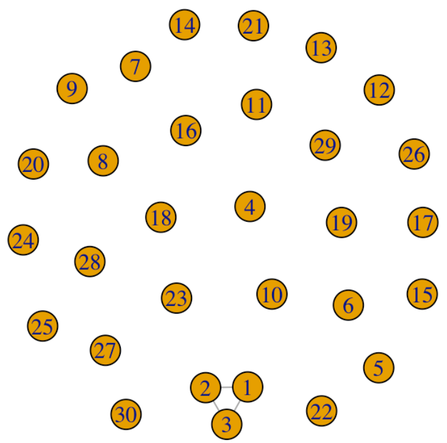

###### Mi solución

```{r grafo2}


grafo <- graph(edges = c(1, 2, 2, 3, 3, 1), n = 3, directed = FALSE)
V(grafo)$name <- as.character(1:3)  

nuevos_nodos <- as.character(4:30)  
grafo <- add.vertices(grafo, nv = length(nuevos_nodos), name = nuevos_nodos)


plot(grafo,
     vertex.size = 30,       
     vertex.label = V(grafo)$name,  
     vertex.color = "#e69f00",   
     edge.color = "grey",   
     edge.width = 2,
     main = "Grafo con Nodos Sin Conexiones del 4 al 30"
)


```

#### Grafo 3

###### Imagen del profe:

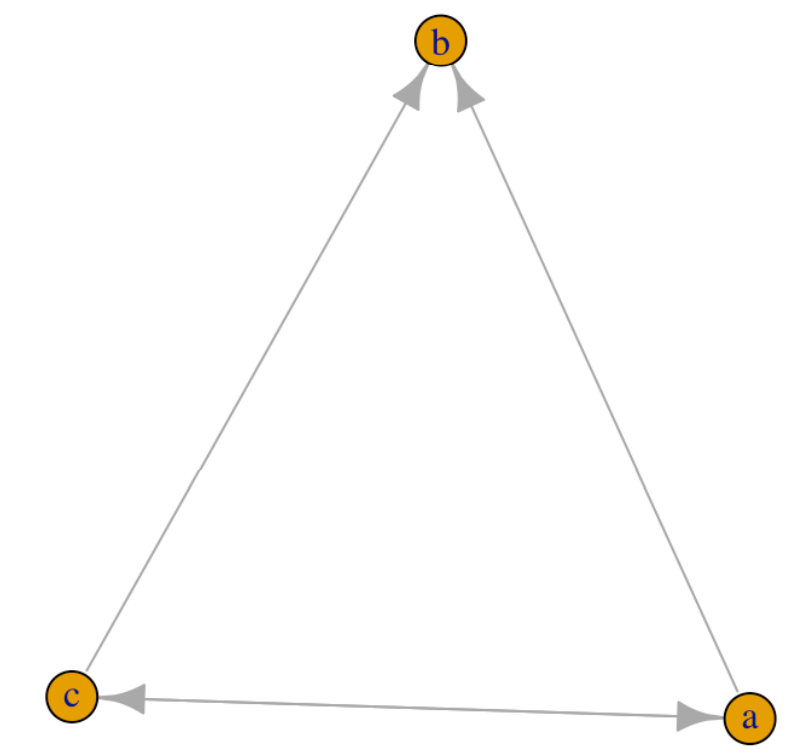

###### Mi solución

```{r igraph3}

grafo <- graph(edges = c("a", "b", "c", "b", "c", "a", "a", "c"), directed = TRUE)


plot(grafo,
     vertex.size = 30,       
     vertex.label = V(grafo)$name,   
     vertex.color = "#e69f00",   
     edge.color = "grey",   
     edge.width = 2 )    
```

#### Grafo 4

###### Imagen del profe:

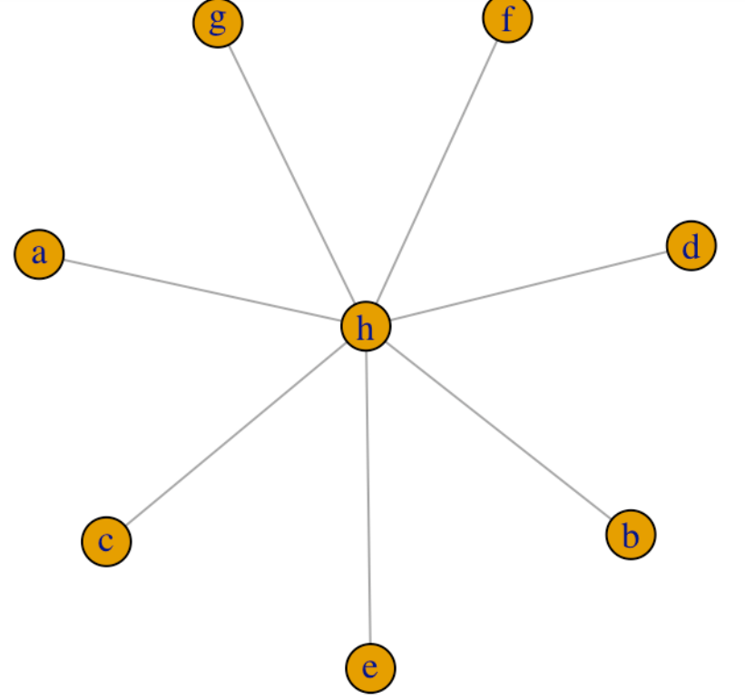

###### Mi solución

```{r grafo4}

grafo <- graph(edges = c("a", "h", "b", "h", "c", "h", "d", "h", "e", "h", "f", "h", "g","h"), directed = FALSE)


layout_star <- layout_as_star(grafo, center = "h")


plot(grafo,
     vertex.size = 30,       
     vertex.label = V(grafo)$name,   
     vertex.color = "#e69f00",   
     edge.color = "grey",   
     edge.width = 2 )    
```

#### Grafo 5

###### Imagen del profe:

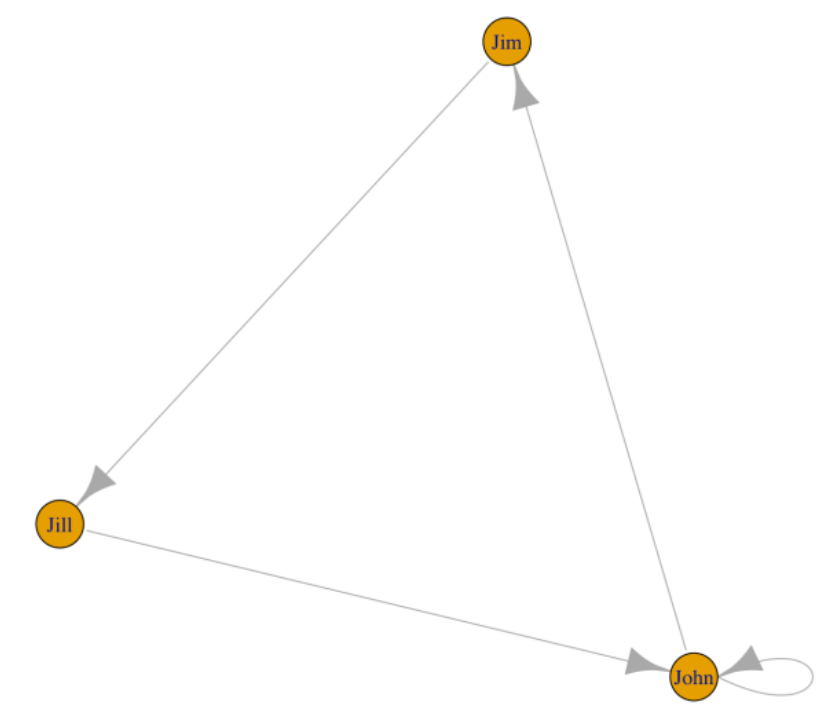

###### Mi solución

```{r grafo5}
# Crear un grafo con 3 nodos y sus conexiones
grafo <- graph(edges = c("John", "Jim", "Jim", "Jill", "Jill", "John", "John", "John"), directed = TRUE)

# Dibujar el grafo
plot(grafo,
     vertex.size = 30,       
     vertex.label = V(grafo)$name,   
     vertex.color = "#e69f00",   
     edge.color = "grey",   
     edge.width = 2 )    
     #main = "Red con 3 nodos conectados",

```

#### Grafo 6

###### Imagen del profe:

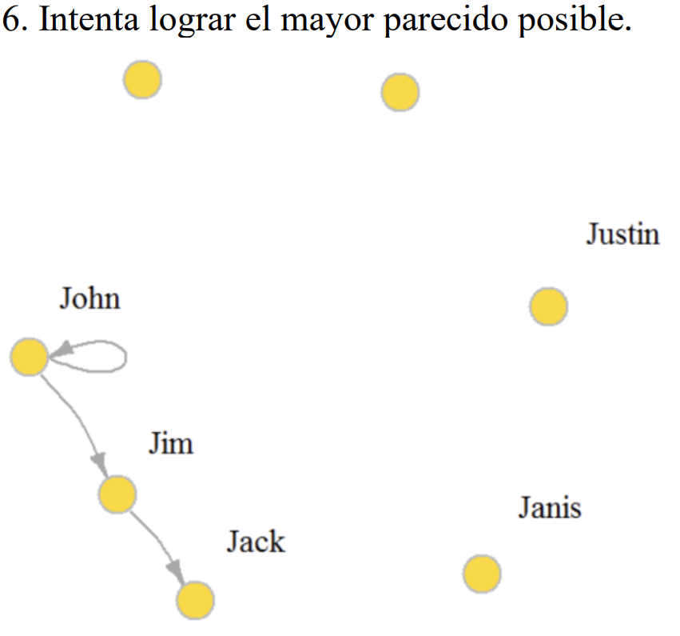

###### Mi solución

```{r grafo 6}
# Crear un grafo con 3 nodos y sus conexiones
grafo <- graph(edges = c("John", "Jim", "Jim", "jack", "John", "John"), directed = TRUE)

# Agregar nodos sin conexiones
grafo <- add.vertices(grafo, nv = 4, name = c("janis", "Justin", "", ""))

# Dibujar el grafo
plot(grafo,
     vertex.size = 30,       
     vertex.color = "#f9d949", #https://imagecolorpicker.com/es 
     edge.color = "grey",
     vertex.label.color="black", #https://r.igraph.org/articles/igraph_ES.html
     vertex.label.dist = 5,      
     label.cex = 1.2,         
     main = "6. intentar lograr el mayor parecido posible." #xd, literalmente lo estoy poniendo como la imagen
)

```

#### Grafo 7

###### Imagen del profe:

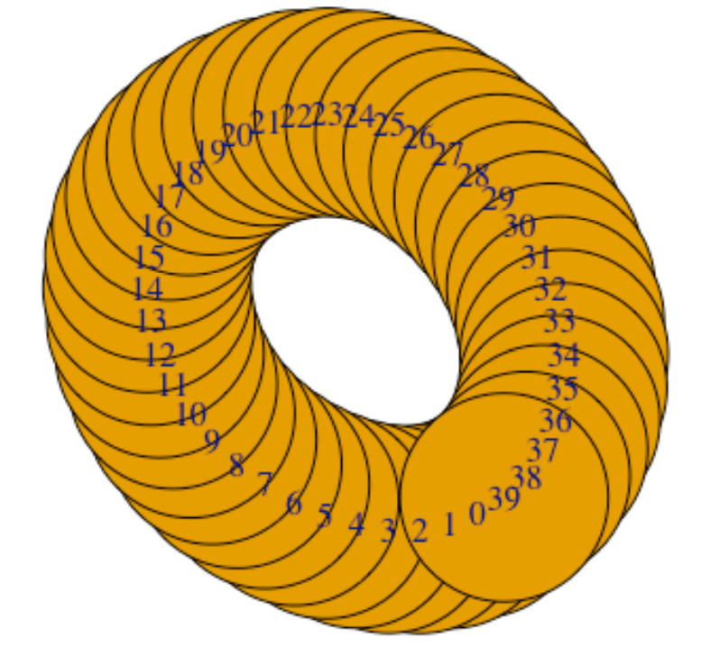

###### Mi solución

```{r grafo7}

# Crear un grafo con 40 nodos (0 a 39) sin conexiones iniciales
nodos <- as.character(0:39)  # Nombres de los nodos
grafo <- make_empty_graph(n = 40, directed = TRUE)  # Grafo vacío con 40 nodos
V(grafo)$name <- nodos  # Asignar nombres a los nodos

# Dibujar el grafo en un layout circular
plot(grafo,
     layout = layout_in_circle(grafo),  # Layout circular
     vertex.size = 99,                   
     vertex.label = V(grafo)$name,       
     vertex.color = "#e69f00",         
     edge.color = "grey",                 
     edge.width = 50)
```

#### Grafo 8

###### Imagen del profe:

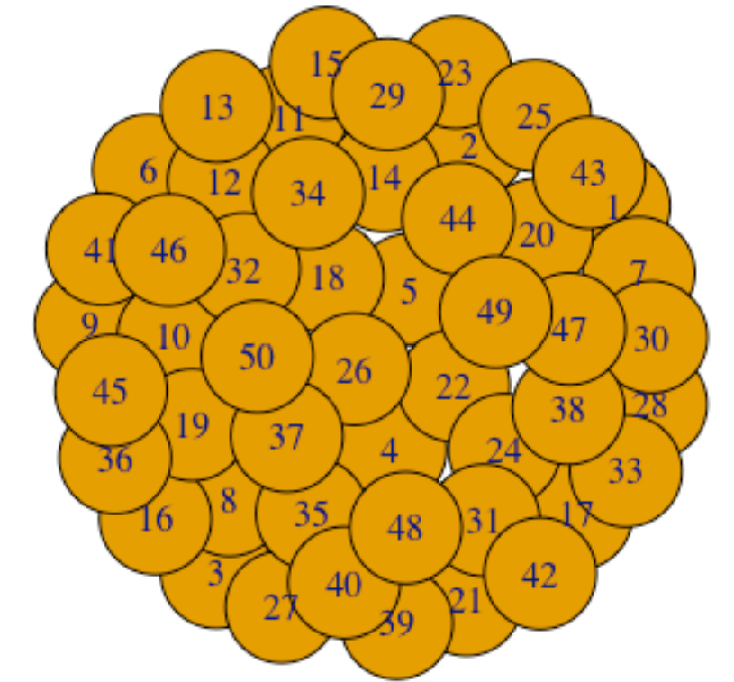

###### Mi solución

```{r GRAFO8}

nodos <- as.character(1:50)  
grafo <- make_empty_graph(n = 50, directed = TRUE) 
V(grafo)$name <- nodos  


plot(grafo,
     vertex.size = 40,                   
     vertex.label = V(grafo)$name,       
     vertex.color = "#e69f00",         
     edge.color = "grey",                 
     edge.width = 50)
```

#### Grafo 9

###### Imagen del profe:

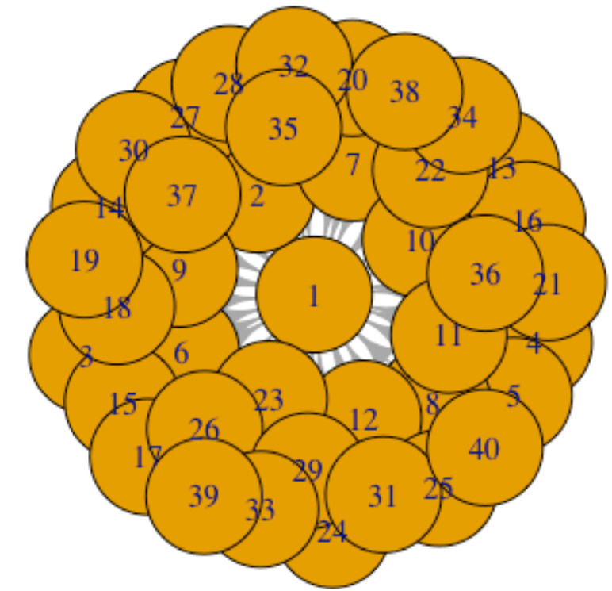

###### Mi solución

```{r grafo9}
 
nodos <- as.character(1:50)   
grafo <- make_empty_graph(n = 50, directed = TRUE) 
V(grafo)$name <- nodos   

 
for (i in 2:length(nodos)) {
  grafo <- add_edges(grafo, c("1", nodos[i]))
}


plot(grafo,
     vertex.size = 40,                   
     vertex.label = V(grafo)$name,       
     vertex.color = "#e69f00",         
     edge.color = "grey",                 
     edge.width = 2 )


```

#### Grafo 10

###### Imagen del profe:

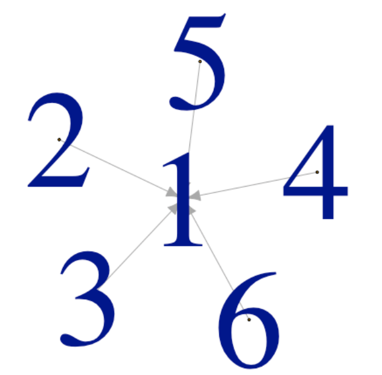

###### Mi solución

```{r grafica10}

grafo <- graph(edges = c(2, 1, 3, 1, 4, 1, 5, 1, 6, 1), directed = TRUE)


layout_star <- layout_as_star(grafo, center = 1)


plot(grafo,
     vertex.size = 1,
     vertex.label.cex= 10,
     vertex.label = V(grafo)$name,   
     vertex.color = "black",   
     edge.color = "grey",   
     edge.width = 2 )    

```
